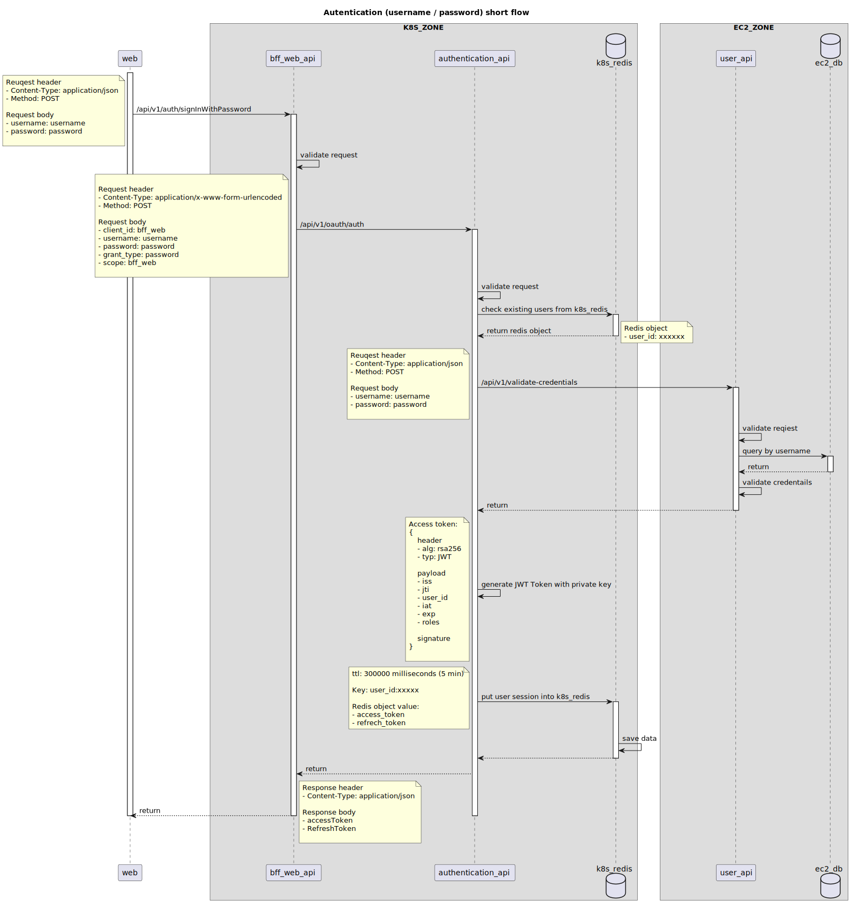

# authentication-short-flow

## tools for start server plant-uml 
https://www.npmjs.com/package/water-plant-uml

### install water-plant-uml
```sh
npm i -g water-plant-uml
```

### run
``` sh
water-uml live -p 8888 document/authentication-short-flow.puml
```

### flow

